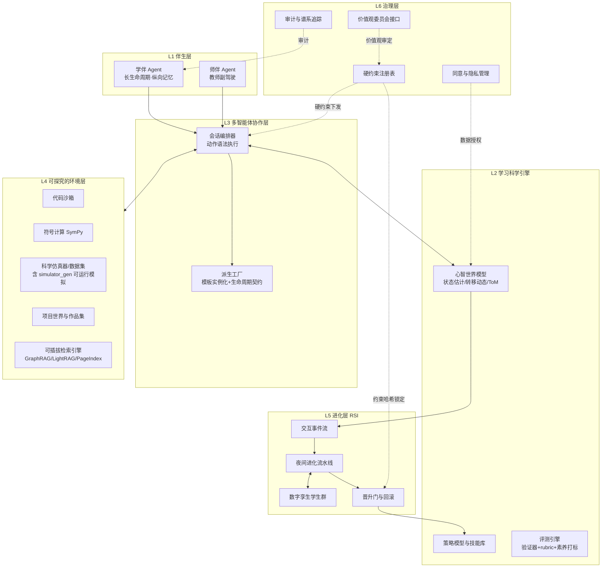
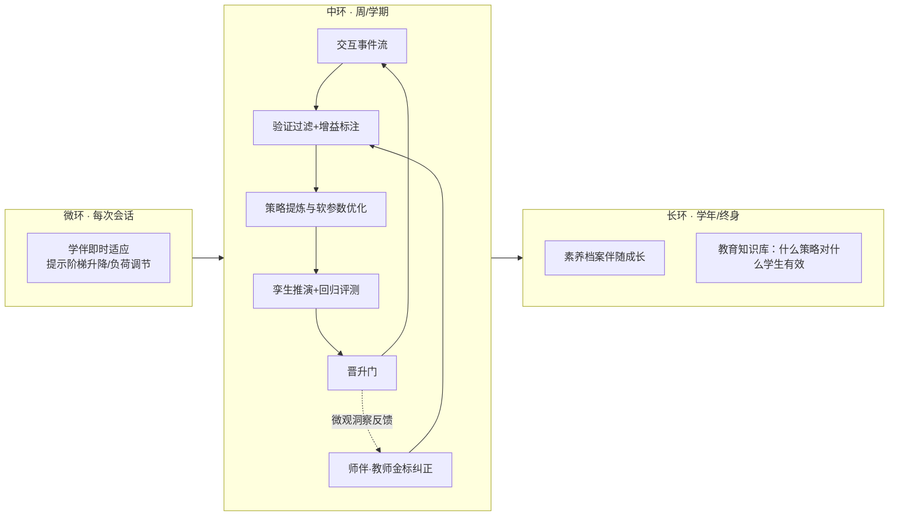

# 01 · 总体架构设计

| | |
|---|---|
| 版本 | v0.1（2026-09-16） |
| 状态 | 设计定稿 |
| 上游输入 | 前期调研：教育智能体开源项目分析（OpenMAIC / DeepTutor / hello-agents 等）、RSI 可行性论证 |
| 下游文档 | 02 状态Schema · 03 动作语法 · 04 进化环接口 · 05 UML · 06 ER · 07 UI |

---

## 1. 愿景与设计原则

### 1.1 一句话愿景

构建**学生、教师的教育伴生智能**：智能体以脚手架方式陪伴学习者走完
「目标设置 → 学习执行 → 反思归纳 → 迭代调整」的自我调节学习（SRL）闭环，
并以闭环产生的真实学习数据为燃料，实现人类与智能体的循环同步进化。

### 1.2 与现有开源教育智能体的本质区别

| 维度 | DeepTutor / OpenMAIC 等 | 本平台 |
|---|---|---|
| 闭环覆盖 | 仅"执行"段（答疑/演示课堂） | SRL 全环（含目标与反思） |
| 学习者建模 | 会话记忆 ≈ 知识追踪 | 结构化心智世界模型（02 号文档） |
| 正确性 | 无验证闭环 | 符号验证器 + 对抗委员会（03/04 号文档） |
| 优化目标 | 答对率、像课堂 | 无辅助表现增量、认知层级跃迁、自主性增益 |
| 进化能力 | 无 | RSI 三环进化（硬约束边界内） |

### 1.3 七条设计原则（全平台强制）

| # | 原则 | 落点 |
|---|---|---|
| P1 | **教育学编码为机制，而非提示词形容词**：ZPD、脚手架渐撤、归因理论等必须落为调度策略、输出约束和奖励函数 | 03 动作语法 / 04 奖励定义 |
| P2 | **状态无智能体，智能体无状态**：持久状态只存在于学习者模型与技能库；智能体是即兴演员，可随时派生、随时注销 | §5 派生机制 |
| P3 | **符号硬约束不可被进化触碰**：进化只调节软参数，永远不能修改教学法红线（防灌输、隐私、不许提前给答案） | §3.3 / 04 晋升门 |
| P4 | **脚手架渐撤是北极星**：`autonomy_index`（自主性指数）与"无辅助表现增量"是首要优化与汇报对象；伴生的终极成功是它的脚手架被拆除的速度 | 02 Schema §3.8 |
| P5 | **不确定性显式**：一切学生状态估计必须带概率与置信区间；模型必须知道自己不知道什么，不确定时动作是"问学生/问教师"而非猜测 | 02 Schema / §4 |
| P6 | **伴生 ≠ 监控**：学生心智数据对教师/家长按角色最小可见；学习者对自己的开放学习者模型拥有完整可见权 | §7 / 07 UI |
| P7 | **真实世界是唯一锚点**：模拟学生只用于演练与进化，一切策略晋升必须有真实小规模 A/B 与真实后测校准，防 Sim-to-Real 漂移与古德哈特陷阱 | §6.4 / 04 §7 |

### 1.4 核心术语

- **SRL**：自我调节学习（Zimmerman 三阶段：前思/执行/自我反思）。
- **KC**：Knowledge Component，知识成分（知识点/技能/概念的原子单元）。
- **心智世界模型**：对"这个学生此刻知道什么、相信什么、感受如何、教了会怎样"的可计算预测模型。
- **数字孪生学生**：以某真实学生的心智状态快照为条件实例化的 LLM 模拟学生。
- **硬约束 / 软参数**：见 §3.3。
- **L0/L1/L2**：进化深度三级（内容外环 / 策略外环 / 权重级），见 §6.2。

---

## 2. 总体架构：六层



**职责表**

| 层 | 职责 | 关键文档 |
|---|---|---|
| L1 伴生层 | 唯一的"常住人口"：学伴（每生长周期记忆）、师伴（教师副驾驶、金标反馈入口） | 05 类图 |
| L2 学习科学引擎 | 心智状态估计与预测、策略选择、教学结果评测 | 02 / 04 |
| L3 多智能体协作层 | 按动作语法执行会话；按需派生角色智能体（提示者/怀疑者/评审者…）；TriggerEngine 介入门（03 §3.1） | 03 / §5 |
| L4 环境层 | 探究的前提是"世界会回应"：沙箱、符号计算、仿真器、数据集 | 05 组件图 |
| L5 进化层 | 交互事件沉淀 → 过滤提炼 → 孪生推演 → 离线进化 → 晋升/回滚 | 04 |
| L6 治理层 | 硬约束注册、同意管理、价值观审定、全链路审计 | §7 |

### 2.1 产品壳（融合自学生方案）

L1–L6 是引擎视图；面向用户的产品形态采用学生方案《未来学习平台》的
**Codex 式三栏工作区**：左侧项目栏（新建/切换/归档学习项目）、中间模块画布、
右侧 AI 对话，三者共享当前项目上下文。学生进入项目后可配置八类功能模块
（今日学习、学习计划、开放任务、课程与资源、阶段测试、学习画像、历史记录、学伴设置），
关闭模块只隐藏入口不删数据。模块是产品入口，不是引擎边界——所有模块最终
都经由动作语法与规则引擎（L3）访问学习科学引擎（L2）。融合细节与冲突裁决见 08 号文档。

---

## 3. 神经-符号设计

### 3.1 为什么教育是神经-符号融合的最佳场景

教育系统里"规则"与"生成"天然并存：课标、知识结构、掌握判定、价值观红线是**符号的**；
对话、启发、诊断、共情是**神经的**。且教育系统对家长/学校/监管有**审计要求**，
符号层天然提供可解释性与可追责性。ACT-R（Cognitive Tutor 内核）本身就是
"产生式规则 + 亚符号激活"的神经-符号混合体，本设计是该传统 + LLM 的延续。

### 3.2 分工

| 符号层（六件套） | 神经层（五件套） |
|---|---|
| 知识图谱 + 素养图谱 + 误区本体库（状态空间定义） | 对话与启发式提问生成 |
| 教学法状态机（提示阶梯 / 5E / 反思关卡） | 过程数据多模态感知（文本、延迟、修改行为） |
| 规则引擎：义务逻辑式硬约束（R-01…R-08，见 03） | 接地生成（每个生成物必须挂接图谱节点，压幻觉） |
| 认知诊断：BKT / DINA / IRT（符号-统计状态估计器） | 学生模拟器（数字孪生，LLM 条件生成） |
| 程序性验证器：SymPy 验算 / 代码执行 / Lean 证明 | 作品与作文的 rubric 评价 |
| 课程规划器：知识图谱上的约束满足 | 隐状态到自然语言的转译（开放学习者模型渲染） |

### 3.3 硬约束 vs 软参数（进化边界）

```text
┌──────────────────────────────────────────────────────────┐
│ 硬约束（哈希锁定，治理签署，进化只读）                      │
│   R-01 第3级提示前禁止给出完整答案                          │
│   R-02 学习契约最终决定权归学生                             │
│   R-05 价值观红线（防灌输内容清单 + 人工复审队列）           │
│   R-08 数据最小化 …                                        │
├──────────────────────────────────────────────────────────┤
│ 软参数（进化环可调节，带回归测试）                           │
│   提问粒度、范例密度、掌握度带宽（85%规则邻域）、             │
│   反馈时机、任务难度调度曲线、孪生温度 …                     │
└──────────────────────────────────────────────────────────┘
```

规则：**进化环必须在每次运行时断言约束集哈希未变**（`hard_constraint_set_hash`），
任何触达硬约束的候选变更直接拒绝并进入治理队列（04 §6）。

### 3.4 四种集成模式

1. **生成-验证门控**：LLM 出题/教案 → 符号层校验（先修满足？认知负荷在带内？认知层级达标？）→ 不过关带约束反馈重生成。
2. **结构接地生成**：知识图谱给骨架，LLM 填内容，产物必须回链图谱节点。
3. **感知→符号状态更新**：神经感知器从过程数据估计状态，写入 02 号 Schema 的符号字段（可审计）。
4. **符号骨架 + 神经即兴**：阶梯/流程是状态机，每一级的文本由神经生成，级别转移由符号判定。

---

## 4. 心智世界模型

### 4.1 三层模型

| 层 | 内容 | 实现 |
|---|---|---|
| ① 认知状态层 | 知识成分掌握向量 + 认知负荷 + 动机情感 | 02 Schema + 神经感知器 + BKT/DKT |
| ② 心智理论层（ToM） | 学生对**材料**的信念（误区=竞争性假设，诊断=贝叶斯假设检验）；对**自己**的信念（自我效能、归因风格）；对**智能体**的信念（信任度→提示接受度） | 误区本体上的后验分布 + 校准的 LLM ToM |
| ③ 生成式模拟器 | 数字孪生学生：以①②为条件，推演"这样教，他会怎么反应" | LLM 条件生成 + 校准报告（04 §5） |

### 4.2 控制论框架

**教学 = 对部分可观测动力系统的闭环控制（POMDP）**

- 状态：学生心智（①②）
- 观测：言语、作答、延迟、修改轨迹、求助方式
- 动作：03 号文档的教学动作语法（QUESTION / HINT / TASK / FEEDBACK…）
- 奖励：真实学习增益 + 认知层级跃迁 + 自主性增益（P7：以真实后测为锚）
- 规划 = machine teaching：在硬约束下选择使预期增益最大且自主性损耗最小的动作序列

### 4.3 教育实证规律 = 转移动态的先验（教育领域独有优势）

| 规律 | 作为先验的用法 |
|---|---|
| 间隔效应 / 遗忘曲线 | 复习调度器的转移先验 |
| 测试效应 | "提取练习"动作的增益加权 |
| 期望难度 85% 规则 | 任务难度调度带宽（软参数，可进化微调） |
| 认知负荷理论 | 任务组合的负荷约束（硬约束 R-06 邻域） |
| 专长反转效应 | 学习者高手化后自动撤除脚手架的策略 |
| 能力可变（成长型思维） | 状态建模禁用"固定能力等级"字段（02 设计规则②） |

### 4.4 开放学习者模型（Open Learner Model）

心智世界模型**默认向学生本人开放渲染**（07 UI 第 3 屏"我的镜子"）：
掌握图谱、误区假设、策略档案、校准曲线。它同时是三样东西——
智能体的预测工具、学生的元认知镜子（SRL 反思原料）、自主性培养的可见进度条。

### 4.5 风险与内置对策

| 风险 | 对策 |
|---|---|
| 自我实现预言（低预测→简任务→停滞→"应验"） | 能力=可变状态非特质；派生任务难度下限保护；群体公平性审计（按分组看任务分配分布） |
| Sim-to-Real 鸿沟 | 孪生分布校准报告 + 真实小规模 A/B 门禁（P7） |
| 古德哈特（优化预测增益偏离真实增益） | 真实后测为不可替代外部锚点；禁止把互动类指标写进奖励 |
| 心智数据隐私 | 最敏感数据类；L6 同意管理与最小可见（P6） |

### 4.6 对接 MWM 框架（Mental World Modeling）

> 参考：牛津大学 & 新加坡国立大学，《Mental World Modeling》，
> arXiv:2607.27201，https://mental-world.github.io （2026）。

MWM 把心智变量（信念、意图、情绪、人格倾向、群体状态、关系、氛围）提升为世界模型的
一等公民并与物理状态耦合建模，其必要性阶梯实验证明：**结构化心智状态 > 自由文本**
（S4 80.3% → S5 82.6% → S6 全框架 87.9%），**耦合双通道 > 解耦**（消融 -6.4%）。
这为我们的符号 Schema 路线（02）和"知识×情感联合建模"提供了外部实证。

**采纳的机制（已落入 02/03/04）：**

| MWM 概念 | 本平台的落点 |
|---|---|
| 物理状态 × 心理状态**耦合转移** | "物理通道"替换为**知识/任务通道**（图谱状态+artifact）；掌握转移依赖情感状态（挫败→坚持性→掌握），情感转移同时依赖动作语义与客观结果——两通道联动建模 |
| 动作 = **载体 × 心智语义** | 03 动作信封新增 `semantic` 字段；心智转移使用**被学生解读的语义**（从反应估计），而非意图语义——同一提示可被解读为鼓励或施压，取决于 02 中的 `trust_in_agent` 与 `self_efficacy`（这两个字段恰好是 MWM 所说决定解读的变量） |
| **第一人称局部观测**（感知权限+认知视角） | 04 孪生模拟器强制挂载观测过滤器：孪生**不得全知**（看不到答案、看不到教师意图），只接收该学生能感知与推断的信息——防止模拟器因全知而失真 |
| MENTIS 六模块可解释流水线（**先分支推演、后决策**，安全一票否决） | 03 编排环：高风险情境（高挫败/高利害）先在孪生上对 top-k 候选动作做分支推演，按"知识合理性×心智一致性×社会恰当性"评分，安全项可一票否决 |
| Oracle 干预结论：**转换模拟是最大瓶颈**（人机差距 81% 来自中间阶段） | 04 孪生校准报告改为**分模块误差分解**（状态解析/观测/转移/评估），研发投入优先砸向转移动态 |

**必须超越 MWM 之处（教育场景的特殊性）：**

1. **多轮纵向**：MWM 是单轮决策基准；我们的心智状态需跨会话持久（02 快照时序）、
   遗忘曲线、慢变量（归因风格）与快变量（注意力）分速演化——这部分 02 已有、MWM 未解。
2. **人格倾向字段的谨慎**：MWM 将性格倾向列为心智状态；本平台允许慢变倾向
   （如归因风格）但禁止任何被解释为稳定能力的特质字段（02 规则②不变）。
3. **群体层的教育化**：MWM 的群体心智/关系/氛围映射到教师端的班级聚合视图
   （07 第 5 屏），但只做聚合呈现，不做个体画像（P6）。
4. 伦理结论与我们 P5/P6 一致且相互印证：心智推断永远是假设而非事实；
   不确定时**选择询问或等待，而非自行动手**——这一条已写入 03 的 `WAIT` 动作与
   01 §4.5 对策表。

---

## 5. 多智能体派生机制

### 5.1 核心原则（P2）

智能体 = 无状态进程。持久状态住在**学习者模型**与**技能库**；
派生 = 模板实例化 + 上下文注入 + 生命周期契约。

### 5.2 四种派生类型

| 类型 | 触发 | 说明 |
|---|---|---|
| ① 需求触发式角色派生 | 编排器侦测到需要（卡壳→提示者；给出证明→怀疑者；完成作品→评审者） | 从 `AgentTemplate` 实例化 |
| ② 数字孪生派生 | 教学策略介入前 | 从学习者快照生成"这个学生"的模拟版本，先在孪生上演练 |
| ③ 技能结晶派生 | 被验证有效的策略 | 结晶为可检索、可版本化的 `SkillEntry`，技能可再派生专用子智能体 |
| ④ 对抗委员会派生 | 关键输出旁 | 临时派生验证者/提问者/评价者委员会（EduPlanner 思路） |
| ⑤ 圆桌研讨派生（v0.3，源自 OpenMAIC） | 高阶认知训练需要多视角时 | 教师+助教+不同立场"同学"的多角色辩论面板；立场由模板注入，任何结论仍须过对抗委员会 |

### 5.3 派生模板五要素

```yaml
agent_template:
  system_prompt: ...        # ① 角色与话术约束
  tools: [sandbox, kg_query]# ② 工具集（最小授权）
  knowledge_slice: ...      # ③ 知识切片（图谱子图引用）
  budget: {max_turns: 6, max_tokens: 8000}   # ④ 预算
  lifecycle:                # ⑤ 终止条件与回报契约
    exit_condition: "report_ready | budget_exhausted | constraint_violation"
    report_contract: SkepticReport   # 必须带回结构化产物
```

### 5.4 生命周期与谱系

`SPAWNED → ACTIVE → REPORTED → TERMINATED`
（异常路径：`BUDGET_EXHAUSTED` / `CONSTRAINT_VIOLATED` → 直接注销并审计）

每个派生体记录谱系（父编排器、模板版本、预算消耗、产物），进入 L6 审计；
**模板参数本身是进化对象**：用孪生学生群 A/B 不同模板参数（如提问深度），
胜出参数经晋升门结晶为新模板版本——派生机制由此接入 RSI 闭环。

---

## 6. RSI 三环进化

### 6.1 三环结构



**"同步迭代"的机制含义**：教师的每一次纠正都是金标数据——师伴把教师隐性教学智慧
显性化、结构化后注入进化燃料；同时智能体把学习过程微观洞察（谁在哪卡壳）反馈教师，
教师的教学技艺随之提升。两条进化线互为师徒，是同一个闭环。

### 6.2 进化深度路线（风险递增，逐级解锁）

| 级别 | 内容 | 门槛 |
|---|---|---|
| L0 内容外环 | 交互→验证过滤→沉淀进 RAG 知识库与题库；DSPy 类工具迭代提示词 | MVP 后即可开 |
| L1 策略外环 | 教学策略 × 孪生学生群离线自博弈，进化技能库与软参数；晋升门+灰度 | 孪生校准达标 |
| L2 权重级 | 脱敏+验证数据夜间 LoRA | L0/L1 双验证有效 + 治理专项审批 |
| 禁止 | 无人监督、在线直接对真学生递归改提示词/策略 | 永久红线 |

### 6.3 晋升门（Promotion Gate，04 §6 详规）

1. 硬约束集哈希未变（P3）
2. 孪生回归评测：约束违规数 = 0；增益 ≥ 基线 − ε
3. 真实小规模 A/B（P7）：后测锚点不劣化
4. 公平性审计通过（分组增益差在阈内）
5. L1 级变更需人工（教师委员会）批准；自动回滚预案常备

### 6.4 校准与反漂移

孪生模拟器周期性用真实交互做**分布校准**（Response Distribution Distance 指标），
校准不达标 → 降低孪生在晋升门中的权重、提高真实 A/B 权重（04 §7）。

---

## 7. 治理与合规

- **硬约束注册表**：哈希锁定 + 治理委员会签名，变更必须走专项流程（§3.3）。
- **价值观治理**：平台公开价值观声明；任务情境中的两难抉择、智能体自身行为示范
  （诚实面对不确定性、承认错误、程序公正）、反思中的伦理维度是三条落地通道；
  **防灌输**：价值观相关内容进入人工复审队列（R-05）。
- **数据**：未成年人数据的最小采集、角色最小可见、可携带权（学生长大带走自己的数据）、
  保留期限；心智状态数据为最高敏感级。
- **伴生 ≠ 监控**：教师/家长可见的是聚合与建议，不是原始心智剖面；学生可见权优先。
- **审计**：全链路谱系（哪版策略、哪个模板、哪份数据产生了这个动作），可回放。

---

## 8. 里程碑

| 里程碑 | 内容 | 验收 |
|---|---|---|
| M0 MVP | 会话编排 + 02 Schema + 提示阶梯状态机 + 验证器（SymPy/代码）+ 单学科题库 | 端到端跑通一次 SRL 会话 |
| M1 L0 内容外环 | 交互事件流 + 过滤沉淀 + 提示词离线迭代 | 知识库周更，回归评测零约束违规 |
| M2 孪生模拟器 | 数字孪生 + 校准报告 | 分布校准达标，可支撑策略 A/B |
| M3 L1 策略外环 | 技能库结晶 + 夜间进化流水线 + 晋升门 + 灰度 | 首个策略版本经全部门禁晋升 |
| M4 师伴与治理 | 教师驾驶舱 + 金标通道 + 家长治理端 | 教师纠正可进入进化数据集 |
| M5 L2 权重级 | 数据管线 + LoRA 夜训 | 治理审批后小流量验证 |

---

## 9. 术语表

见 §1.4；补充：**晋升门**（Promotion Gate）= 策略版本上线的强制检查链；
**金标数据** = 教师纠正/标注产生的高置信训练信号；
**开放学习者模型** = 向学生本人渲染的心智模型视图。
