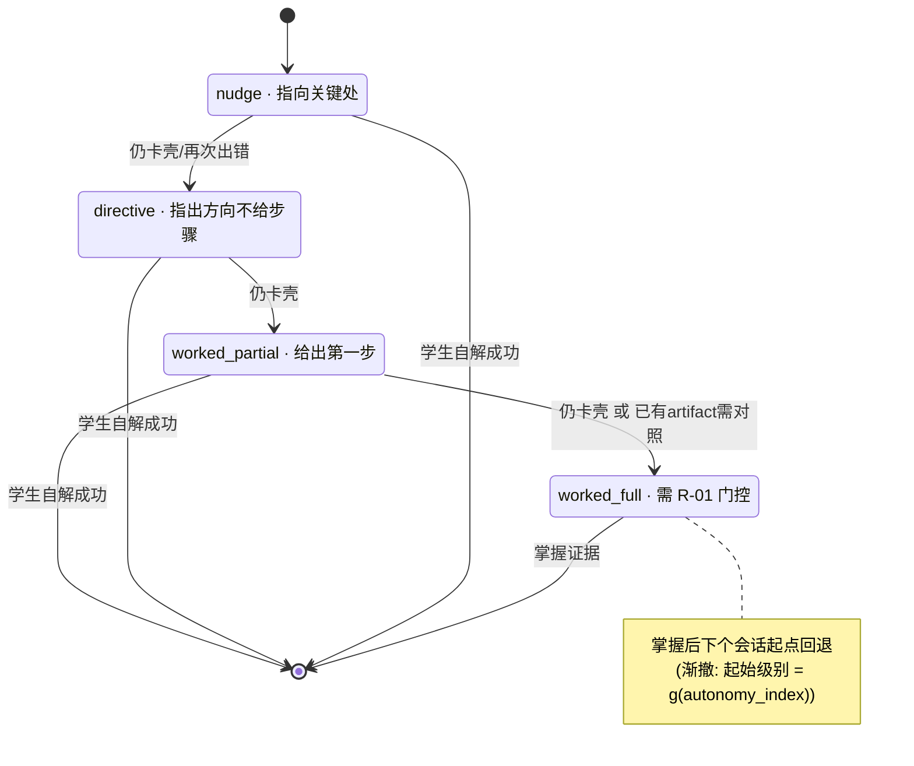
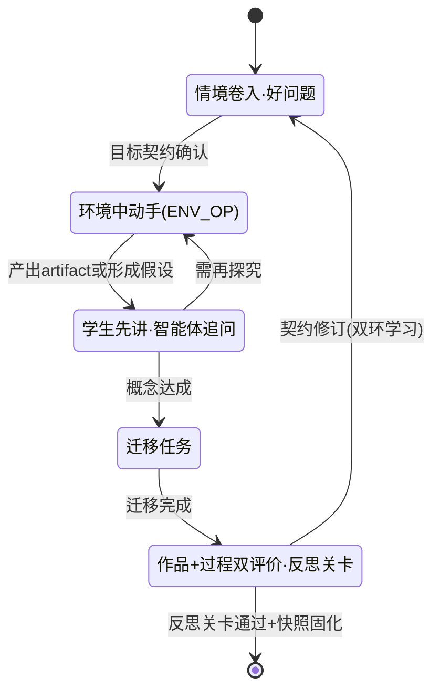
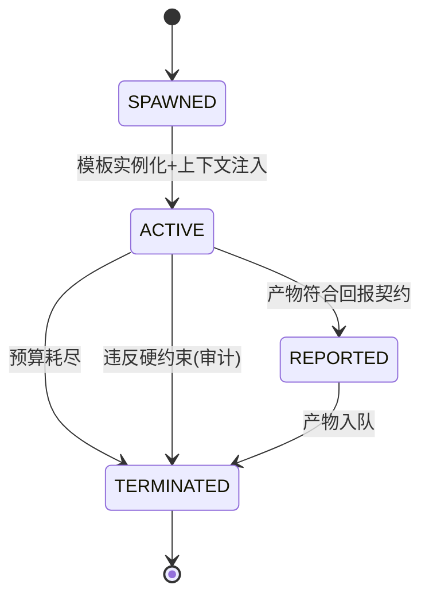

# 03 · 核心规格：动作语法与教学法状态机

| | |
|---|---|
| 版本 | v0.1（2026-09-16） |
| 状态 | 设计定稿 |
| 上游 | 01 §3.3 硬约束、01 §4.2 POMDP 动作空间 |
| 下游消费方 | 05 UML（时序/状态图）、编排器与规则引擎实现 |

本文件定义智能体"能做什么动作、以什么格式做、被什么规则约束、在什么状态机里做"。
**教育学原则在此落为机器可执行的语法与约束（原则 P1）**。

---

## 1. 动作信封（Action Envelope）

一切教学动作（无论由学伴还是派生体发出）必须封装为信封，方可通过规则引擎放行：

```jsonc
{
  "action_id": "act_20260916_0001f3",
  "session_id": "sess_...",
  "actor": { "kind": "companion | derived_agent", "ref": "agent_id", "template_version": "..." },
  "type": "HINT",                          // §2 类型系统中的一员
  "params": { "ladder_level": 1, "form": "nudge", "target_kc": "MATH.G7.EQ.LINEAR" },
  "semantic": { "intent": "support", "social_meaning": "encourage" },
  // ↑ 动作=载体×心智语义(MWM框架): 载体由type+params描述, 意图语义在此显式声明;
  //   心智状态转移使用"被学生解读的语义"(02 in_session_state.last_action_interpretation),
  //   解读取决于学生当时的 trust_in_agent 与 self_efficacy, 而非发送者的意图
  "state_refs": {                          // 决策依据的快照引用(可审计)
    "mental_state_snapshot": "uuid",
    "policy_version": "policy_v42",
    "skill_refs": ["skill_socratic_g7_03@2.1.0"]
  },
  "policy_provenance": { "generated_by": "LLM-xxx", "grounded_to_kg": ["node_id"] },
  "budget": { "max_tokens": 500, "deadline_ms": 3000 }
}
```

规则引擎（ActionGovernor）按 §3 硬约束 + 状态机当前态对信封做 **允许 / 改写 / 拒绝** 三值裁决。
被拒绝的动作连同原因写入审计（这也是进化环最重要的负样本来源之一）。

---

## 2. 动作类型系统

> 前置条件读自 02 号 Schema 快照；效果字段即 Schema 字段；约束为规则引擎强制项。

| 类型 | 关键参数 | 前置条件 | 状态效果（写回） | 约束 |
|---|---|---|---|---|
| `GOAL_NEGOTIATE` | mode: elicit/refine/revisit | 会话开始或契约到期 | 生成/修订 `GoalContract` | R-02 最终选择 `authored_by=student` |
| `ENGAGE` | scenario_ref | 契约 active | engagement 初值 | 情境必须接地真实语境 |
| `QUESTION` | intent: diagnostic/socratic/metacognitive; target_kc; depth | — | 误区后验、认知状态 | diagnostic 必须能区分至少两个误区假设 |
| `HINT` | ladder_level 1-4; form: nudge/directive/worked_partial/worked_full | 阶梯状态机允许该级 | hint_level、策略档案 | R-01/R-07 |
| `EXPLAIN` | mode: conceptual/procedural; target | **门控**：`ladder_level ≥ 3` 或学生已产出 artifact | p_mastery 证据 | R-01/R-06 内容必须回链图谱节点 |
| `TASK` | kind: inquiry/practice/project/transfer; difficulty | 难度落入 85% 带；先修满足 | kc_masteries、认知负荷 | R-03 挫败保护；任务禁止直接奖励互动指标 |
| `FEEDBACK` | kind: verification/attribution/process | 有可评对象 | 自我效能、归因风格 | R-04 禁能力归因措辞 |
| `REFLECTION` | prompt_type: attribution/calibration/transfer/ethical | 会话里程碑或结课 | metacognition、素养证据 | 反思为必经关卡，不可跳过（可延后） |
| `PEER_SIMULATE` | twin_config / role: peer/devil_advocate | 孪生校准达标 | 策略档案（演练记录） | 孪生产物不得直接当真实证据 |
| `ENV_OP` | tool: python/sympy/simulator/dataset/simulator_gen/external_coding_agent | 最小授权；外部 Agent 仅白名单 | 产出 artifact → 验证器 | R-08 数据最小化；`simulator_gen`（生成可运行 HTML/JS 模拟）与外部编程 Agent 产出**一律过验证器**；沙箱只读外部 |
| `ESCALATE` | to: teacher/human_review; reason | R-03/R-05 触发或学生请求 | 教师干预队列 | 升级永不惩罚学生 |
| `WAIT` | duration_hint | 挣扎是生产性的（productive struggle） | — | 单次等待有上限 |

### 2.1 教学模式库（v0.3，源自 OpenMAIC）

`TASK.params.pattern` 与 `ENGAGE.params.pattern` 从模式库取值——**模式是内容载体，
不是流程骨架**：5E 会话状态机不变（联动"动作 = 载体 × 心智语义"，本库扩展载体维度）。
所有模式生成物（幻灯/测验/模拟/任务书/活书）均为生成内容，走 REVIEW_RECORD 送审，
**大纲先审后展开**（approve 前不得批量生成正文）：

| pattern | 形态 | 验证与约束 |
|---|---|---|
| `slides_lecture` | 配音+白板板书讲解，可导出 PPTX | 内容回链 KG 节点（R-06） |
| `quiz` | 生成测验，暂停批改+上下文解释 | 题目过验证器；考题引用受 R-09 管辖 |
| `interactive_sim` | 生成可运行 HTML/JS 交互模拟 | 运行时安全检查 + 验证器（ENV_OP `simulator_gen`） |
| `pbl` | 项目任务书+工具链+AI 导师+作品批改 | 作品走 Verdict 全流程 |
| `live_book` | 资料编译为嵌测验/闪卡/交互的活书，每页可对话（v0.3，源自 DeepTutor） | 每个嵌入件独立验证 |
| `whiteboard` | 单知识点白板即时课堂（即时协助） | 讲解受 R-01 门控 |

---

## 3. 义务逻辑硬约束（R-01 … R-08）

> 硬约束 = 哈希锁定的规则集（01 §3.3），进化环只读。违反即拦截 + 审计。

| # | 规则 | 形式化要点 |
|---|---|---|
| R-01 | **不许提前给答案** | `allow(EXPLAIN(worked_full)) ⟺ hint_level == 3 已耗尽 ∨ ∃student_artifact ∧ 教师策略允许` |
| R-02 | **目标归学生所有** | `GOAL_NEGOTIATE` 产出的 `success_criteria` 终稿 `authored_by ∈ {student}`；智能体只能提案 |
| R-03 | **挫败保护** | `frustration > θ_high` 持续 k 轮 → 强制切 `FEEDBACK(support)` 或 `ESCALATE`；禁止此时上调任务难度 |
| R-04 | **归因纪律** | `FEEDBACK` 文本经归因分类器校验：禁止能力归因（"你很聪明/你不行"），只允许努力与策略归因 |
| R-05 | **价值观红线** | 防灌输内容清单过滤 + 命中即转人工复审队列；价值观话题采用多视角呈现模板 |
| R-06 | **接地约束** | 一切 `EXPLAIN`/`TASK` 内容必须绑定图谱节点（`grounded_to_kg` 非空且有效） |
| R-07 | **脚手架预算递减** | 每会话智能体主动提示次数 ≤ `f(autonomy_index)`（单调递减函数）；自主性越高，主动干预越少 |
| R-08 | **数据最小化** | `ENV_OP` 与状态采集按会话目的最小化；无授权不采集新模态 |
| R-09 | **考试模式隔离**（源自学生方案） | `TestAttempt` 进行中：`allow(QUESTION/EXPLAIN/HINT 且 target=考题)` == false，仅允许 `EXPLAIN(规则说明)`；提交后统一解锁并展示得分、错误分布与误区假设更新 |

软参数（可进化）：θ_high、k、难度带宽、提示预算函数 f 的形状、FEEDBACK 时机分布、孪生温度。

### 3.1 介入门：TriggerEngine（何时值得提议动作，融合自学生方案）

```text
事件/状态流 ──> [TriggerEngine] ──> 介入提案(带触发规则ID/置信度) ──> 进入 §5 编排环
                判据: 事件类型 × 状态阈值 × 冷却期 × 最小置信度
```

- TriggerEngine 只回答"**何时值得看一眼**"，不回答"做什么动作"（POMDP 策略的职责），
  更不能绕过 ActionGovernor 的硬约束裁决。
- **冷却期**（同一规则对同一学生的最小触发间隔）与置信度阈值是软参数，
  且受 R-07 脚手架预算约束——防打扰是脚手架渐撤在运营层面的表现。
- 介入提案被教师否决或学生拒绝时，记录回流（04 §8 金标通道）——否决即标注。
- **晨间简报**（v0.3，源自 Hyperknow 主动学习节奏）：TriggerEngine 之上增加夜间
  `MorningBriefingJob`——按"截止日期临近度（02 external_deadline_refs）× 薄弱点
  （02 误区/掌握）× 契约进度"生成今日待办排序，作为主动学习流面板（07 UI-05）的内容源；
  排序依据必须可解释（经 02 §3.4 记忆图谱钻取到原始事件）。

---

## 4. 三套教学法状态机

### 4.1 提示阶梯（Hint Ladder）——ZPD + 脚手架渐撤



渐撤规则：新会话起始级别 = `g(autonomy_index)`——自主性越高，起点越低（干预越少）。
**"脚手架拆除速度"由此成为状态机参数。**

### 4.2 会话主流程（5E 探究式）



### 4.3 派生智能体生命周期



---

## 5. 会话编排伪代码（编排器职责的一句话化）

```text
loop 每个交互回合:
  0. 触发: TriggerEngine 判定本回合是否有介入提案(冷却期/置信度通过才进入后续步骤)
  1. 感知: 过程数据 → 神经感知器 → 候选状态更新(带不确定性)
  2. 固化: 候选更新通过 Schema 校验 → 写入 MentalStateSnapshot(append-only)
  3. 选动作: 策略模型提出 top-k 候选; 高风险情境(高挫败/高利害决策)先在孪生上
     分支推演各候选(MENTIS原则: 绝不在构建分支之前选择答案), 按
     "知识合理性 × 心智一致性 × 社会恰当性"评分, 安全项一票否决
  3b. 裁决: ActionGovernor 依 R-01..R-08 + 当前状态机 → 允许/改写/拒绝
  4. 解读回写: 心智状态转移使用"被学生解读的语义"(从其下一反应估计并写入
     02 in_session_state.last_action_interpretation), 而非动作的意图语义
  5. 执行: 动作发送; 需要时派生角色智能体(§4.3 生命周期)
  6. 记录: InteractionEvent 落事件流(04 §1) → 供反思、评测与进化
```

---

## 6. 验收要点（实现时作为单测/夹具）

- [ ] 构造 `frustration=0.9` 连续 3 轮 → 任何 `TASK(difficulty+)` 被 R-03 拒绝
- [ ] `hint_level < 3` 且无 artifact → `EXPLAIN(worked_full)` 被 R-01 拒绝且审计留痕
- [ ] `autonomy_index` 0.9 的学生会话 → 智能体主动提示次数预算显著小于 0.3 的学生（R-07 单调性）
- [ ] `FEEDBACK` 含能力归因措辞 → 被 R-04 改写为策略归因
- [ ] 每个拒绝事件在事件流中可回放，可统计各规则触发分布（进化环负样本）
