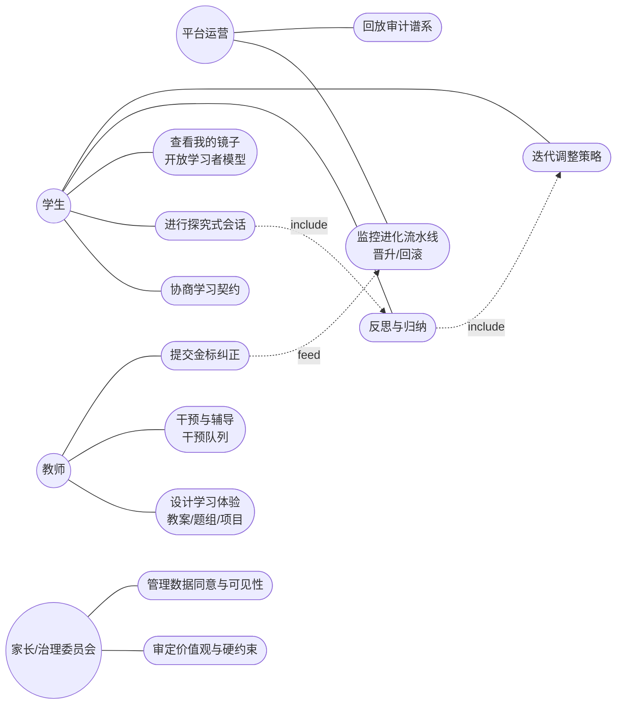
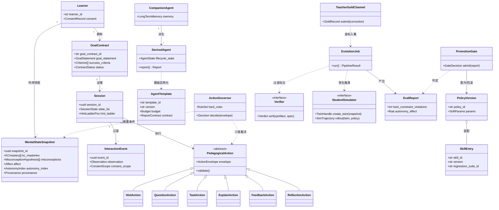
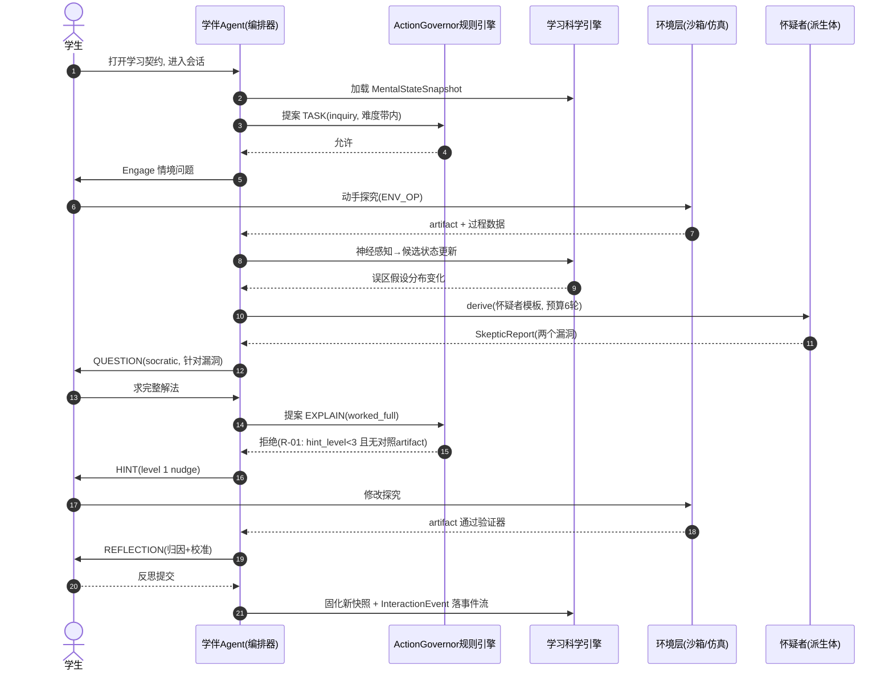
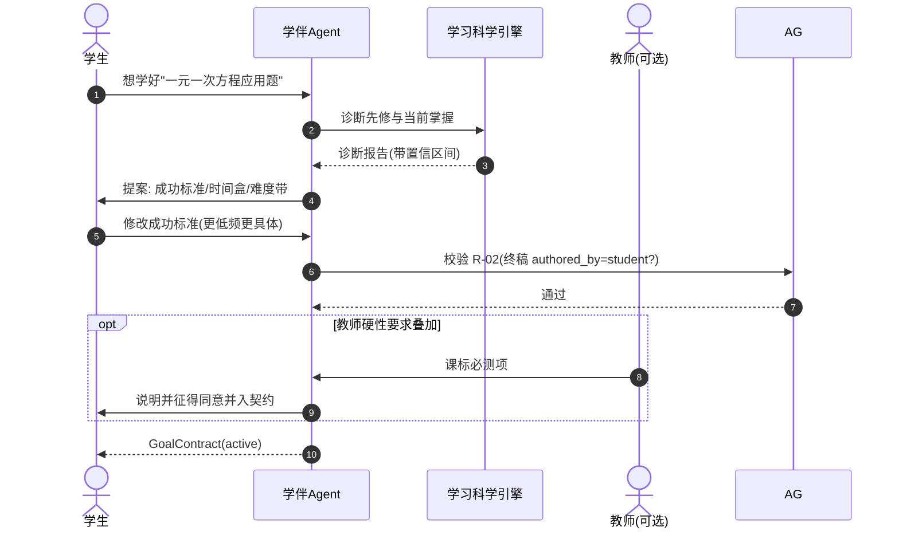
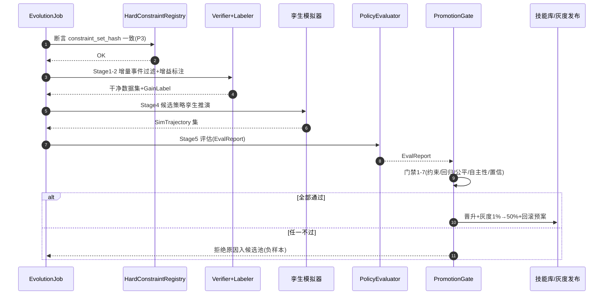
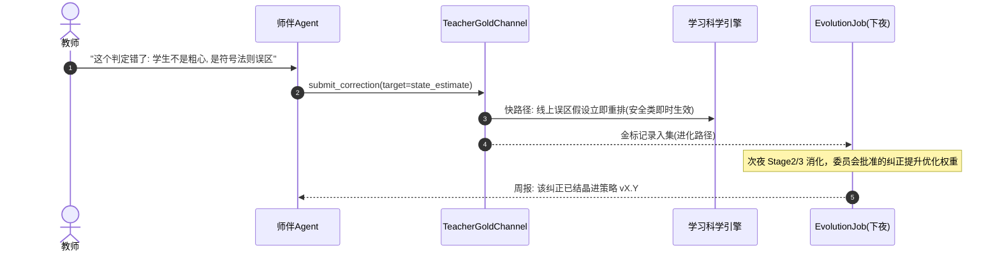
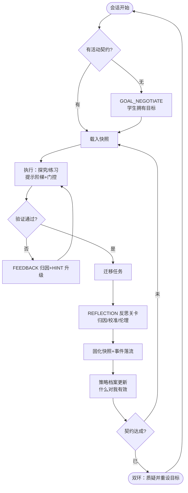
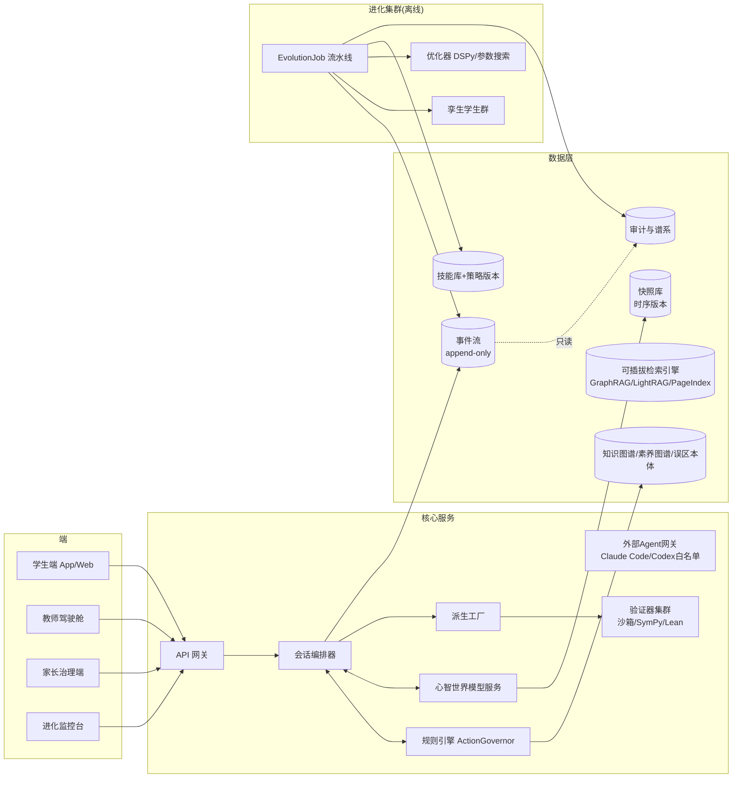

# 05 · UML 图集

| | |
|---|---|
| 版本 | v0.1（2026-09-16） |
| 状态 | 设计定稿 |
| 说明 | 全部使用 Mermaid（GitHub/IDE 可直接渲染）；类图承载行为、ER 图（06）承载数据，二者互补不重复 |

---

## 1. 用例图（Mermaid 以流程图近似）

---

## 2. 类图（核心领域模型）

---

## 3. 时序图

### 3.1 探究式学习会话（含派生与门控）

### 3.2 目标契约协商（目标归学生所有，R-02）

### 3.3 夜间进化环（中环）

### 3.4 教师金标注入（同步进化枢纽）

---

## 4. SRL 闭环活动图（微环）

---

## 5. 组件图（部署视角）

---

## 6. 状态图补充

03 号文档已含提示阶梯 / 5E 会话 / 派生体生命周期三套状态机，
本文件不重复。开发时以 03 §4 为状态机唯一权威来源。
