# 06 · ER 图与数据字典

| | |
|---|---|
| 版本 | v0.1（2026-09-16） |
| 状态 | 设计定稿 |
| 说明 | 数据视角（持久化）；行为视角见 05 类图。存储选型建议：事件流/快照=时序化存储（如 ClickHouse/Postgres+分区），图谱=图库或关系表均可，策略版本=Git 式版本库 |

---

## 1. ER 图

```mermaid
erDiagram
    LEARNER ||--|| CONSENT_RECORD : "签署"
    LEARNER ||--o{ GOAL_CONTRACT : "设定"
    LEARNER ||--o{ MENTAL_STATE_SNAPSHOT : "拥有快照"
    GOAL_CONTRACT ||--o{ SESSION : "治理"
    SESSION ||--o{ INTERACTION_EVENT : "产生"
    SESSION ||--o{ ARTIFACT : "产出"
    ARTIFACT ||--o{ VERDICT : "被验证"
    TASK_SPEC ||--o{ ARTIFACT : "要求"
    INTERACTION_EVENT }o--|| PEDAGOGICAL_ACTION : "由动作引发"
    INTERACTION_EVENT }o--o{ MENTAL_STATE_SNAPSHOT : "证据引用"
    MENTAL_STATE_SNAPSHOT }o--o{ KC : "掌握状态"
    MENTAL_STATE_SNAPSHOT }o--o{ COMPETENCY : "素养状态"
    MENTAL_STATE_SNAPSHOT ||--o{ MISCONCEPTION_HYPOTHESIS : "误区假设"
    MENTAL_STATE_SNAPSHOT ||--o{ STRATEGY_ATTEMPT : "策略档案"
    STRATEGY_ATTEMPT }o--|| SKILL_ENTRY : "引用技能"
    POLICY_VERSION ||--o{ SKILL_ENTRY : "装配"
    SKILL_ENTRY ||--o{ REGRESSION_SUITE : "专属回归集"
    EVOLUTION_RUN ||--o{ EVAL_REPORT : "产出"
    EVAL_REPORT }o--|| POLICY_VERSION : "评估候选"
    EVAL_REPORT ||--o| PROMOTION_DECISION : "判定"
    PROMOTION_DECISION }o--|| POLICY_VERSION : "目标版本"
    TEACHER ||--o{ TEACHER_CORRECTION : "提交"
    TEACHER_CORRECTION }o--|| INTERACTION_EVENT : "针对"
    EVOLUTION_RUN }o--o{ TEACHER_CORRECTION : "消化金标"
    SESSION }o--o{ DERIVED_AGENT_LOG : "派生记录"
    DERIVED_AGENT_LOG }o--|| AGENT_TEMPLATE : "实例化自"
    INTERACTION_EVENT ||--o{ AUDIT_LOG : "审计留痕"
    LEARNER ||--o{ LEARNING_PROJECT : "拥有"
    LEARNING_PROJECT ||--o{ PROJECT_MODULE : "配置"
    GOAL_CONTRACT ||--o{ PLAN_VERSION : "展开为计划版本"
    LEARNING_PROJECT ||--o{ PLAN_VERSION : "归属"
    TRIGGER_RULE ||--o{ INTERVENTION : "触发"
    INTERVENTION }o--|| PEDAGOGICAL_ACTION : "落在动作上"
    TASK_SPEC ||--o{ REVIEW_RECORD : "AI生成内容送审"

    LEARNER {
        string learner_id PK
        string display_name
        string grade_band
        datetime created_at
    }
    CONSENT_RECORD {
        string consent_id PK
        string learner_id FK
        string scope "teaching|evolution|research"
        bool guardian_signed
        datetime expires_at
    }
    GOAL_CONTRACT {
        string goal_contract_id PK
        string learner_id FK
        text goal_statement
        string authored_by "必须=student"
        json success_criteria
        json difficulty_band
        string status
    }
    SESSION {
        string session_id PK
        string goal_contract_id FK
        string state_5e
        string hint_ladder_pos
        datetime started_at
    }
    PEDAGOGICAL_ACTION {
        string action_id PK
        string session_id FK
        string type
        json params
        string policy_version
        string governor_decision "allow|rewrite|deny"
        string denied_rule "R-01..R-08"
    }
    INTERACTION_EVENT {
        string event_id PK
        string learner_pseudo_id "脱敏伪ID"
        string session_id FK
        datetime ts
        string observation_kind
        string payload_ref
        string consent_scope
    }
    ARTIFACT {
        string artifact_id PK
        string session_id FK
        string kind "code|proof|essay|model|dataset_result"
        string storage_ref
    }
    TASK_SPEC {
        string task_id PK
        string kc_refs
        int taxonomy_level_target
        json difficulty_band
        string kg_grounded_node "R-06"
    }
    VERDICT {
        string verdict_id PK
        string artifact_id FK
        string status
        float score
        string taxonomy_level
        string verifier_id
        text explainability
    }
    KC {
        string kc_id PK
        string subject
        string prerequisites
        int default_taxonomy_ceiling
    }
    COMPETENCY {
        string competency_id PK
        string framework "4C|核心素养|自定义"
        int scale_max
    }
    MISCONCEPTION_HYPOTHESIS {
        string snapshot_id FK
        string space_id
        json posterior
        json planned_discriminators
    }
    MENTAL_STATE_SNAPSHOT {
        string snapshot_id PK
        string learner_id FK
        string schema_version
        json knowledge_state
        json affect_motivation
        json autonomy_index
        json provenance
        datetime created_at
    }
    STRATEGY_ATTEMPT {
        string attempt_id PK
        string snapshot_id FK
        string skill_id FK
        string skill_version
        string outcome
    }
    SKILL_ENTRY {
        string skill_id PK
        string version PK
        json body
        json applicable_context
        string regression_suite_id FK
        string status
    }
    REGRESSION_SUITE {
        string suite_id PK
        string skill_id FK
        json test_cases
        float pass_threshold
    }
    POLICY_VERSION {
        string policy_id PK
        string version PK
        json soft_params
        string parent_version
        string status "candidate|canary|active|rolled_back"
    }
    EVOLUTION_RUN {
        string run_id PK
        datetime started_at
        string constraint_set_hash
        string stage_reached
        string status
    }
    EVAL_REPORT {
        string report_id PK
        string run_id FK
        int hard_constraint_violations
        json sim_gain
        json regression_delta
        json fairness_audit
        float autonomy_effect
        float sim2real_confidence
    }
    PROMOTION_DECISION {
        string decision_id PK
        string report_id FK
        string target_policy_version FK
        string outcome "promoted|candidate_pool|rejected"
        string approver "teacher_committee|null"
        json canary_plan
    }
    TEACHER {
        string teacher_id PK
        string display_name
    }
    TEACHER_CORRECTION {
        string correction_id PK
        string teacher_id FK
        string target_ref
        json correction
        text rationale
        string path "fast|evolution"
    }
    DERIVED_AGENT_LOG {
        string agent_id PK
        string session_id FK
        string template_id FK
        string template_version
        string lifecycle_end_state
        json budget_usage
        string report_ref
    }
    AGENT_TEMPLATE {
        string template_id PK
        string version PK
        json five_elements
    }
    AUDIT_LOG {
        string audit_id PK
        string event_id FK
        string actor
        string action
        datetime ts
    }
    LEARNING_PROJECT {
        string project_id PK
        string learner_id FK
        string name
        string status "active|archived"
        datetime archived_at
    }
    PROJECT_MODULE {
        string config_id PK
        string project_id FK
        string module_type
        int sort_order
        bool enabled
    }
    PLAN_VERSION {
        string version_id PK
        string goal_contract_id FK
        string project_id FK
        string status "draft|confirmed|superseded"
        string change_reason
        json content
        datetime confirmed_at
    }
    TRIGGER_RULE {
        string rule_id PK
        string event_type
        json threshold
        int cooldown_seconds
        float min_confidence
        bool enabled
    }
    INTERVENTION {
        string intervention_id PK
        string trigger_rule_id FK
        string learner_id FK
        string action_ref
        string student_response
        float effect_metric
    }
    REVIEW_RECORD {
        string review_id PK
        string target_ref
        string reviewer
        string decision "approve|reject|revise"
        text rationale
    }
```

---

## 2. 数据字典（关键表补充说明）

### 2.1 `INTERACTION_EVENT`（进化唯一原料，04 §1）

| 字段 | 约束 | 说明 |
|---|---|---|
| `learner_pseudo_id` | 非空 | 进化集群只接触伪 ID；真 ID 映射保留在主库并由 L6 管控 |
| `payload_ref` | 非空 | 明文负载存对象存储，事件流只存指针+摘要（数据最小化，R-08） |
| `consent_scope` | 枚举 | `evolution` 不在其中 → 对流水线不可见（权限在查询层强制） |
| 修改策略 | — | **append-only**；纠错用补偿事件，禁止 UPDATE/DELETE |

### 2.2 `PEDAGOGICAL_ACTION`（03 信封的持久化形态）

| 字段 | 约束 | 说明 |
|---|---|---|
| `governor_decision` | allow/rewrite/deny | 三值裁决必填；`rewrite` 必须存改写前后 |
| `denied_rule` | R-01..R-08 | deny 时必填；拒绝分布是进化环重要负样本 |

### 2.3 `MENTAL_STATE_SNAPSHOT`（02 Schema 落库）

| 字段 | 约束 | 说明 |
|---|---|---|
| `schema_version` | 常量校验 | 破坏性变更必须带迁移器（02 规则6） |
| `knowledge_state` 等 JSON 字段 | JSON Schema 校验入库前强制 | 校验器由 02 号文档的 Schema 直接生成 |
| 特质字段扫描 | CI 强制 | 库内出现 `aptitude/iq/ability_level` 即构建失败（02 规则2） |

### 2.4 `POLICY_VERSION` / `EVAL_REPORT` / `PROMOTION_DECISION`

| 约束 | 说明 |
|---|---|
| `EVOLUTION_RUN.constraint_set_hash` 必须等于注册表当前哈希 | P3 的落库体现；不等则 Stage1 前中止 |
| `EVAL_REPORT.hard_constraint_violations = 0` 才允许生成 `PROMOTION_DECISION` | 数据库 CHECK + 门禁双重强制 |
| `PROMOTION_DECISION.outcome = promoted` 且策略为 L1 级 → `approver` 必填 | 人工批准位（04 §6 判定6） |

### 2.5 保留与删除策略汇总

| 数据 | 保留 | 删除/匿名化 |
|---|---|---|
| 交互事件明文负载 | 12 个月滚动 | 到期匿名化为统计特征 |
| 心智快照 | 12 个月滚动 | 同上 |
| 学习契约 / 素养档案 | 长期（学生要求可带走） | 可携带导出（01 §7） |
| 策略版本 / 评测报告 / 审计 | 永久 | 不可删（谱系完整性） |
| 学习项目 | 归档制：archived 只隐藏不删除（学生方案原则） | 仅显式数据删除流程后物理删除 |

### 2.6 融合新增实体（v0.2，源自学生方案）

| 实体 | 说明 | 关键约束 |
|---|---|---|
| `LEARNING_PROJECT` / `PROJECT_MODULE` | 学习项目容器与模块配置（八模块增删/排序/启停） | 关闭模块只置 `enabled=false`，禁止级联删除业务数据 |
| `PLAN_VERSION` | 计划版本：草案→确认→被取代；带变更原因与确认时间 | `status=confirmed` 前不得作为执行依据（ConfirmationService，R-02 邻域）；挂在 GoalContract 之下 |
| `TRIGGER_RULE` | 介入门规则：事件类型、阈值、冷却期、最小置信度（03 §3.1） | 冷却期/阈值为软参数，可进化调节 |
| `INTERVENTION` | 介入提案与执行记录：`student_response`、`effect_metric` 回填 | `effect_metric` 是进化环的直接原料（04 Stage 2 的干预效果标签） |
| `REVIEW_RECORD` | AI 生成内容（资源/题目/教案段）的送审记录 | R-05 扩展为全量生成内容送审；`decision=approve` 前不得对学生呈现 |

**数据边界裁决（08 §3 裁决①）**：产品视图（对话、计划、画像、历史）按 `project_id`
隔离；学习者心智快照（02）挂 `learner_id`、跨项目累积，事件流同时携带
`learner_pseudo_id` 与 `project_id` 标签——上下文按项目，模型按人。
