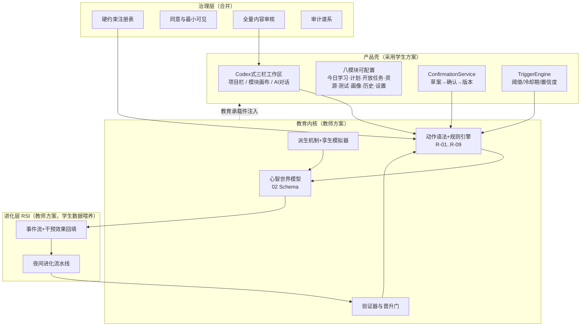

# 08 · 融合方案与优势说明（教师方案 × 学生方案）

| | |
|---|---|
| 版本 | v0.2（2026-09-18） |
| 输入 A | 本目录 01–07 号设计文档（下称"教师方案"：学习科学引擎 + 进化内核 + 治理） |
| 输入 B | 学生方案《未来学习平台_系统建模与UI流程设计》（14 屏高保真 UI + 五层架构 + 项目/模块数据模型，下称"学生方案"） |
| 结论 | **两案正交互补**：学生方案给出产品形态与工程追溯，教师方案给出教育学内核与进化能力。融合 = 学生方案的产品壳 × 教师方案的教育内核，冲突处按下文裁决。 |

---

## 1. 结论摘要

1. 两份方案不是竞争关系，而是**同一系统的两层**：教师方案回答"凭什么有教育价值、凭什么可信、凭什么会越来越好"（引擎与治理），学生方案回答"长什么样、怎么用、数据放哪、怎么验收"（产品壳与工程）。二者拼合恰好覆盖对方盲区。
2. 融合动作：**采用学生方案的 14 屏高保真 UI、项目/模块数据模型、TriggerEngine、计划版本化、内容审核工作流为基座**；**注入教师方案的心智世界模型、动作语法与硬约束、提示阶梯、派生机制、RSI 进化环、治理层为内核**。
3. 四处设计冲突全部裁决（见 §3），最关键的一条：**产品视图按项目隔离，学习者模型按人累积**。
4. 融合后方案的相对优势见 §5，共七条，核心是：学生的每一条正确"直觉"都被升级为可执行的"机制"，教师的每一份"规格"都获得了可触摸的"车身"。

---

## 2. 逐维度对比

| 维度 | 教师方案（01–07） | 学生方案 | 互补判断 |
|---|---|---|---|
| 产品形态 | 8 屏 ASCII 线框，教育承载件齐全但无整体信息架构 | **Codex 式三栏工作区**（项目栏/模块画布/AI 对话）+ 八模块可配置，14 屏高保真 | 学生强；采用为基座 |
| 数据容器 | 无"项目/工作区"概念，快照直接挂学习者 | LEARNING_PROJECT + PROJECT_MODULE，归档不删除、关闭模块不删数据 | 学生强；并入 06 |
| 教育学理论 | SRL 闭环、ZPD 渐撤、归因纪律、Bloom、5E、双环学习，全部落为状态机与规则 | 有正确**直觉**（证据画像、分层帮助、测试禁答、计划先草案后确认）但停留在 prose | 教师强；学生直觉逐条映射到机制 |
| 学习者建模 | 心智世界模型（02）：不确定性显式、误区=贝叶斯假设、情感动机、自主性指数、MWM 对接 | LearningProfile 四个扁平字段（知识/任务/投入/素养） | 教师强；学生四分类保留为**展示视图**，内核换 02 快照 |
| 动作与规则 | 动作信封 + R-01…R-08 规则引擎 + 门控裁决 | 交互规则写在验收章节（10.3/10.4），无强制机制 | 教师强；学生 10.3.3 升级为 R-09 |
| 计划与确认 | GoalContract（目标/成功标准/学生签署） | LEARNING_PLAN + **PLAN_VERSION**（草案→确认、变更原因）+ ConfirmationService | 学生强；并入并挂接契约 |
| 介入时机 | POMDP 策略解决"做什么动作" | **TriggerEngine**：事件/状态/阈值/**冷却期**/置信度决定"是否介入" | 学生强；并入为反应层（见 §3 裁决②） |
| 智能体组织 | 伴生 + 按需派生（怀疑者/评审/孪生）+ 对抗委员会 | 六类常驻功能 Agent + Education Harness 路由 | 各取一半：六类 Agent=常驻职能，派生做临时角色 |
| 内容安全 | 价值观人工复审（R-05），覆盖面窄 | 通用**内容审核工作流**（review_status/ReviewRecord） | 学生强；升级 R-05 为全量 AI 生成内容送审 |
| 进化能力 | RSI 三环（验证器→孪生→晋升门），独有 | 无；但 INTERVENTION 带 effect_metric、事件带 state_before，**恰好是进化原料** | 教师强；学生数据设计天然兼容 |
| 治理 | 同意管理、伴生≠监控、审计谱系、硬约束注册表 | 管理治理台、权限、内容审核 | 合并进 L6 |
| 工程治理 | 各文档分立验收清单 | **五向追溯矩阵**（功能↔UI↔流程↔Agent↔数据）+ 跨切面验收表（§10.4） | 学生强；并入 08 §4 与 07 |

---

## 3. 冲突裁决（四条，均为两案真实分歧处）

**① 项目数据隔离 vs 学习者纵向模型。**
学生方案要求"数学学习的对话/计划/画像不出现在 Python 基础中"——用于**产品展示**完全正确，保留；
但自主性、素养、心智模型必须跨项目累积（人是连续的，不是按项目切换的）。
裁决：**产品视图按项目隔离，学习者模型按人累积**——02 快照挂 `learner_id` 不挂 `project_id`，
交互事件流带 `project_id` 标签；ConversationService 的项目级上下文不变（上下文 ≠ 模型）。

**② TriggerEngine 与 POMDP 策略的关系。**
裁决：分两层，互不越权——TriggerEngine（便宜、反应式）只回答"**何时值得看一眼**"；
POMDP 策略（昂贵、深思式）回答"**做什么动作**"；任何动作最终仍过 ActionGovernor 硬约束。
TriggerEngine 的冷却期与置信度阈值登记为软参数，受 R-07 脚手架预算约束（防打扰 = 渐撤的运营面）。

**③ 计划状态机与 5E 会话状态机。**
学生的 S0–S7（未规划→…→检查点→反思中→需调整）是**跨会话的学习进程态**；
我们的 5E 是**单会话内的探究流程态**。二者作用域正交，都保留：
S3"学习中"内部跑 5E，S7"需调整"对接 PlanVersion 草案流。

**④ 学伴设置的学生自调支架权 vs 系统控制的渐撤。**
学生方案允许学生自选支架档位（CompanionSetting.support_level）——若学生把直接讲解常开会与
自主性目标冲突。裁决：**带内自调**（尊重选择权，选择权本身就是自主性练习）；
把档位调到带外时展示"自主性代价提示"并记入策略档案信号；硬红线（R-01/考试模式）不可被任何设置解除。

---

## 4. 融合后的整体形态

**落盘清单（本版已实际修改的文档）**

| 文档 | 变更 |
|---|---|
| 01 | §2 新增 2.1 产品壳小节（三栏工作区+八模块并入六层架构）；L3 职责补 TriggerEngine |
| 02 | GoalContract 关联 PLAN_VERSION（版本化外壳） |
| 03 | 新增 R-09 考试模式硬约束；§3.1 介入门 TriggerEngine；编排伪代码补 step 0 |
| 06 | ER 增补 LEARNING_PROJECT / PROJECT_MODULE / PLAN_VERSION / TRIGGER_RULE / INTERVENTION / REVIEW_RECORD 六实体 + 数据字典 2.6 |
| 07 | 采用学生 14 屏为高保真基座，原线框降级为教育承载件规格，给出逐屏注入映射表 |
| 08 | 本文档：对比、裁决、优势 |

---

## 5. 新方案的优势（相对两案单用）

1. **形神合一**：解决教师方案"引擎没有车身"、学生方案"车身没有引擎"的对称缺陷。产品壳让平台第一天就可演示可用，教育内核让它配得上"教育"二字。
2. **直觉全部机制化**：学生的"分层帮助"变成带渐撤参数的提示阶梯；"计划先草案后确认"变成 ConfirmationService + R-02；"测试中 AI 不给答案"变成可单测的 R-09；"画像由证据形成"变成假设分布 + evidence_refs。**直觉靠善意，机制靠约束——好感变成承诺**。
3. **介入决策经济分层**：TriggerEngine 用冷却期、置信度挡掉 90% 的打扰（近零成本），POMDP+孪生推演只花在高利害决策上——算力与体验双优化，这是单用任何一层都做不到的。
4. **数据模型一次成型**：容器层（项目/模块/计划版本）+ 认知层（心智快照/误区假设）+ 进化层（事件流/技能库/策略版本）三层齐备；学生方案 INTERVENTION.effect_metric 与 state_before 字段恰好补上了进化环"干预效果回填"的原料缺口。
5. **治理覆盖完整且分级**：内容审核从价值观复审扩展为全量 AI 生成内容（资源/题目）送审；硬约束注册表升级为 R-01…R-09；同意管理与项目归档不删除策略互补。
6. **验收从散文变契约**：学生方案的跨切面验收表 + 教师方案的规则引擎，使"测试独立性""项目隔离""对话连续性"等都成为 CI 可执行断言，而非口头约定。
7. **北极星不被产品自由度稀释**：模块可配置、支架可自调给了学生结构自主权——这本身就是自主性培养的一部分；所有自由度都被 R-07 预算与 autonomy_index 北极星约束住，产品越自由，指标越诚实。

---

## 6. 给学生方案的反馈（评审意见，供面谈用）

**亮点（值得保持）**：五向追溯矩阵是合格的工程治理实践；"画像由学习证据形成，不以单一总分代替具体表现"和数据不足时标"暂时无法判断"——这句话与学界开放学习者模型（OLM）的规范完全一致，说明直觉很好；归档不删除、关闭模块不删数据的数据生命周期意识成熟。

**待提升（融合已补齐）**：① 学习者模型停留在四个扁平字段，缺不确定性表达与误区假设（见 02）；② 交互规则停留在验收 prose，缺强制机制（见 03 规则引擎）；③ 平台自身不会从运营数据中进化（见 04）；④ 智能体组织是静态六件套，缺按需派生与对抗校验（见 01 §5）。这四点不是推倒重来，而是在其架构骨架上"长"出内核——融合后学生方案的骨架全部保留。
