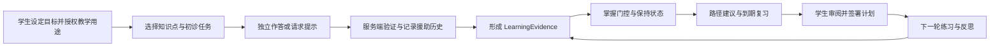
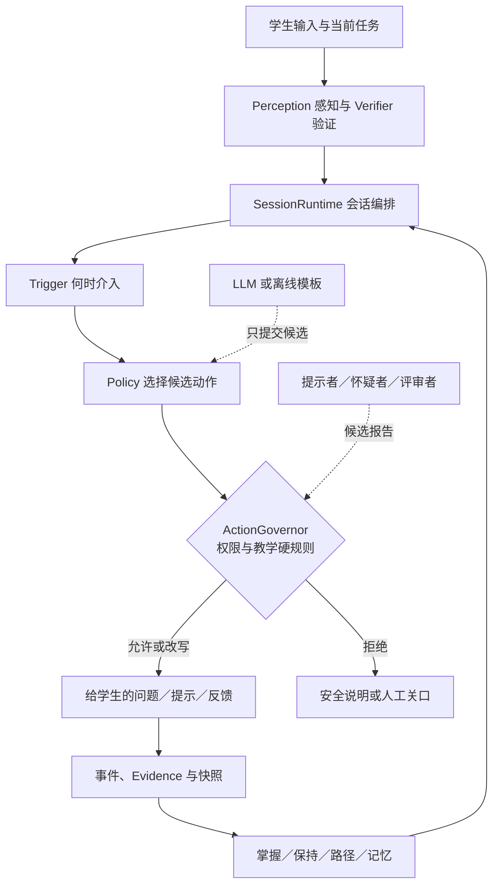
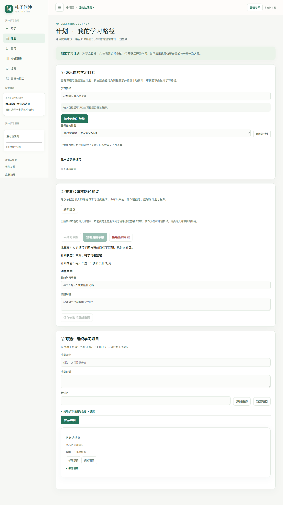
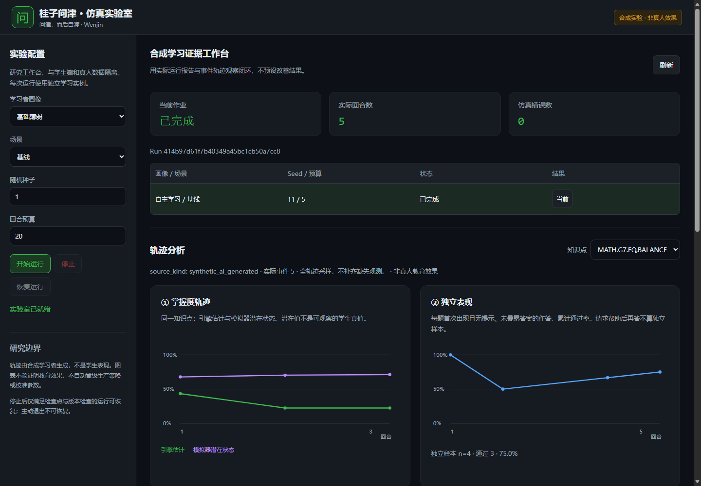

# 桂子问津 EduAgent：项目介绍与本地运行

> 面向第一次接触项目的开发者、教师和研究伙伴。核对日期：2026-10-08；代码分支：`V5`，提交 `7f1224f`。本文区分**已经运行的软件能力**与**未来试点、生产目标**。本次演示使用隔离的合成学习者与本地数据。

## 一分钟认识项目

桂子问津（Wenjin）要做的是一个陪伴学生长期学习的教育 Agent 平台。它希望学生从“依赖提示才能完成”逐步走向“能独立尝试、解释、检验和复习”。因此，系统记录的不只是一次聊天或一道题的对错，还包括题目版本、作答方式、是否用过提示、验证结果、时间、授权和证据来源，再据此安排下一步学习。

今天的 V5 是**本地研究型 MVP**：学习工作台、学习证据闭环、计划签署、复习、多个候选教学角色和合成学习者实验室已经有代码和本地页面。当前随项目提供的演示课程只覆盖等式和一元一次方程；输入“洛必达法则”等未导入主题时，系统可登记课程需求并检查受信本地资料，不会给出无关的方程路径。课程需求仍需资料补充、题目和评测制作、教师审核与发布，尚不能直接教学。它可以演示机制及验证软件行为；真实课程审核、真人学习效果、学校生产身份和完整生产部署仍需要单独完成。

### 项目想解决什么

- 学生只看答案容易产生“会了”的错觉。系统先让学生尝试，再按需提供逐级提示，并区分独立表现和辅助表现。
- 单次正确不足以说明长期掌握。系统把每次有效作答保存为可追溯证据，分别估计**掌握状态**和**保持／复习状态**。
- AI 的建议可能不准确或越权。模型只产生候选教学动作；规则、权限、来源和人工关口决定动作能否交付。
- 教学设计需要先验证。合成学习者实验室可在隔离环境比较策略和观察轨迹，但结果只表示模拟器内的行为，不能代替真人试点。

## 学生会经历怎样的学习流程



典型的一轮是：学生选择“一元一次方程”任务，自己解答；服务端验证并保留本次是否使用提示。之后，学习状态依据合格证据更新，路径模块提出下一步任务，复习模块给出到期队列。学生可以接受、修改或拒绝计划草案；**签署权在学生手里**。如果证据不足，页面会保留空状态或“不足以判断”，不会填造分数。

## 目前有哪些功能

| 使用者／入口 | 已做的事 | 关键边界 |
|---|---|---|
| 学生：`/`、`/learning` | 六个视图：陪学、计划、复习、成长证据、设置、圆桌与探究；发题、作答、提示、会话恢复、项目任务、目标和计划 | 当前是本地研究体验；教学用途需授权 |
| 学习证据服务：`/api/learning/*` | 版本化题目、发题凭据、验证结果、Evidence、掌握估计、保持状态、重放、到期复习及 V5 的未来 24 小时队列预览 | 提示后作答和独立作答分开；预览不会改变计划 |
| 教师：`/teacher` | 阅读待评作品，给出 Rubric 复核，追加纠正记录 | AI 不能冒充教师签名 |
| 家长：`/parent` | 在学习者明确共享和授权下读取摘要 | 不提供原始作答与证据明细 |
| 本地研究／治理：`/research` | 来源导入、检索、恢复任务等本地操作 | 不是学校生产 RBAC 或 SSO |
| 圆桌与探究 | 来源检索、提示者／怀疑者／评审者候选报告、三角色圆桌、教虚拟学生 | 候选报告不直接改掌握状态，也不替学生签计划 |
| 仿真实验室：本次 `8002` | 选择画像、场景、随机种子与预算，运行合成学习者；查看轨迹、报告、四类分析图与比较 | 与真人数据隔离，不能声称真实教学效果 |
| 开发与运维 | OpenAPI、SQLite 本地主库、学习域 PostgreSQL Repository 切片、备份／隔离恢复、有界 worker、自动化测试 | 尚非全平台 PostgreSQL 生产系统 |

V5 在 V4 基线上补了陪学对话和角色协作的交互、题库与测试、复习未来队列预览，并调整角色输出与提示预算。旧 V4 文档仍是大量功能的技术基线；判断 V5 的现状应以当前源码和本次验证为准。

## Agent 如何参与，为什么它不会直接“替学生做完”

系统保留一个主要教学控制器：`SessionRuntime`／`TutorSession` 负责会话、教学阶段和工具调用；长期学习状态由学习服务与存储持有。Agent 可以读当前任务、学习证据和受授权的来源，提出“提问、提示、反馈、推荐”等候选。每个候选先进入 `ActionGovernor` 检查，结果可能是**允许、改写或拒绝**。例如学生直接索要答案时，规则可以把完整解答改为下一步提示。



几个关键分工：

1. **验证器与证据层**记录“实际观察到什么”；不可验证的结果只审计，不当作掌握证据。
2. **掌握门控、保持调度和路径推荐**处理“当前证据支持什么下一步”；掌握与记住多久是不同状态。
3. **Trigger／Policy／Governor**分别判断“是否介入、建议怎么介入、能否执行”。教育硬规则在代码与测试中，不只写在提示词里。
4. **派生角色**各有受限职责。提示者给渐进支架，怀疑者追问漏洞，评审者反馈策略；角色输出有结构化契约、证据引用、时间和输出预算，不能自行调用工具或写入学习状态。
5. **模型接入**经统一 Provider 适配器；没有 API Key 时可用 `FakeLLM`／固定模板做本地演示。外部模型文本被视为待验证候选，不直接成为事实。
6. **人工关口**负责计划签署、教师 Rubric、课程准入与参数晋级。模拟器和模型都不能代签。

## 技术上怎么实现

| 层次 | 当前技术与目录 | 作用 |
|---|---|---|
| Web 与 API | FastAPI、Uvicorn；`platform/app/gateway/`；原生 HTML/CSS/JavaScript 位于 `platform/web/` | 本地工作台、角色页面、OpenAPI 与 JSON 接口；前端无需构建步骤 |
| 数据契约与验证 | Pydantic、SymPy；`app/core/`、`app/learning/verifier.py` | 动作信封、状态模型、数学答案验证与规则裁决 |
| 教学编排 | `app/orchestration/`、`app/agent/`、`app/agents/` | 会话、5E 教学阶段、触发、策略、派生角色及工具门禁 |
| 学习闭环 | `app/learning/` | 题目／课程资产、Evidence、BKT 掌握估计、门控、保持调度、路径、记忆和指标 |
| 来源与模型 | `app/learning/retrieval.py`、`app/llm/`、`app/governance/` | 固定本地根目录检索、来源追踪、OpenAI 兼容 Provider 与治理 |
| 存储与隔离 | SQLite 默认运行；`app/storage/` 中有学习域 PostgreSQL Repository；`app/school/` | 事件／快照、幂等收据、事务和学校独立研究实例 |
| 仿真与测试 | `app/simulation/`、`platform/tests/`、`platform/scripts/` | 合成画像、独立运行数据、报告、浏览器和 API 回归 |

一次提交的核心路径是：路由检查授权、学习者、题目版本和发题凭据；验证器生成 Verdict；学习服务把 Evidence、消费收据和状态变化放在同一本地事务中；前端再读取有效证据和派生状态。相同 Evidence ID 的重复消费应保持幂等；修正或撤回后，可按有效证据重建状态。研究实验的潜在状态保存在独立运行目录，不写进真人学习证据。

## 代码进度与最终构想

**已完成的研究 MVP 基线：** V4 文档记录了当时的深色工作台、学习闭环、四类成长图、仿真实验室、治理和本地运维的验收；当前 V5 学习工作台已改为浅色阅读布局，并增加目标覆盖检查、课程需求登记与目标范围内的路径推荐。本次核对确认 `V5` 分支已在本机运行。工作台和实验室的首页、授权状态与实验室配置接口均返回 HTTP 200；实验室实际完成一笔 5 回合的合成运行并显示分析图。

**当前仍要完成：** 真实课程由教师逐题审核并冻结、教材来源与授权确认、真人试点伦理和监护授权、真实样本校准、真实 Provider 的故障与成本验证，以及生产级身份、租户、全平台 PostgreSQL、常驻作业、监控、TLS 和灾备。软件能跑与教育效果成立是两道不同的验收门。

**最终构想：** 在可审计的学习证据之上，形成跨会话的个人学习路径：学生有目标和选择权，Agent 在需要时提供逐渐撤除的帮助，教师和家长通过有边界的入口参与，研究者先在隔离仿真与受授权试点中验证策略，再经人工审核逐步进入正式教学。核心衡量应关注无辅助表现、可迁移的理解和学习者自主性，而非聊天次数。

## 本机如何部署与访问

本次实际使用 Windows、Python 3.12 虚拟环境和锁文件安装依赖。仓库说明推荐 Python 3.11；重现历史 V4 验收时应使用其指定环境。本地没有配置远程模型 Key，运行模式为 `FakeLLM`。演示主库单独放在被 Git 忽略的 `platform/data/local-demo/wenjin.sqlite3`，不会使用历史个人库。

```powershell
cd C:\Users\21709\Desktop\桂子问津EduAgent\EduAgent\platform
$env:UV_CACHE_DIR = (Join-Path (Get-Location) '.uv-cache')
uv sync --locked --extra dev --no-editable --python C:\Software\Anaconda3\python.exe

# 终端一：主工作台，按本次要求使用 8001
$env:WENJIN_PORT = '8001'
$env:WENJIN_DB_PATH = './data/local-demo/wenjin.sqlite3'
$env:WENJIN_LOCAL_AUTH_ENABLED = 'false'
.\.venv\Scripts\python.exe -m app.main

# 另开终端二：仿真实验室，避免与主服务冲突
.\.venv\Scripts\python.exe -m app.simulation.lab --port 8002 --output-root data/local-demo/simulation
```

打开 [学习工作台](http://127.0.0.1:8001/)、[教师入口](http://127.0.0.1:8001/teacher)、[家长入口](http://127.0.0.1:8001/parent)、[研究入口](http://127.0.0.1:8001/research)、[API 文档](http://127.0.0.1:8001/docs) 或 [仿真实验室](http://127.0.0.1:8002/)。默认源码把主服务设为 8000、实验室设为 8001；**本次为满足主入口 8001 的要求，才将实验室调整为 8002**。终端进程停止后重新执行上述启动命令即可。

### 本次部署实拍

以下画面来自本机实际运行的页面。学习工作台使用隔离演示学习者与合成课程；图中“洛必达法则”是使用者输入的范围外目标，页面会阻止签署旧方程草案，也可将其登记为课程需求。图中尚未填入学生作答，不能看作学习效果。



仿真实验室截图展示已完成的 5 回合合成运行与从报告、轨迹读取的分析图。图中数值是模拟器输出。



## 本次核对结果与已知问题

| 检查 | 结果 |
|---|---|
| Git | 当前 `V5`，HEAD `7f1224f`；目录中原有未跟踪文件 `witch V4` 未改动 |
| 安装 | `uv sync --locked --extra dev --no-editable` 安装成功；使用项目内 `.uv-cache` |
| 端口 | 主服务 `127.0.0.1:8001`，实验室 `127.0.0.1:8002` |
| HTTP | 主首页、授权状态、`/docs`、实验室首页与配置接口均为 200 |
| Python 测试 | `794 passed, 33 skipped, 1 failed, 2 warnings`（当前 V5、本机 Python 3.12） |
| 仿真页面 | 5 回合作业已完成，报告和图表实际显示；现有浏览器烟测在轨迹文本包含 `ANSWER` 的断言处失败，未完成其全部流程 |

唯一失败的 Python 用例是 `tests/test_course_governance.py::test_reproducible_seed_is_pending_complete_and_simulation_only`：冻结的 V3 课程包与当前源码生成包不再完全相等。24 道题的引用数量和顺序仍相同，但当前合成来源文件的 SHA256 与冻结包记录不同，连带课程包哈希也不同。本次尚未确定差异从哪个历史版本开始。应由后续开发明确冻结包是否保持 V3 基线，或为当前版本建立新的冻结包与对应测试；在此之前不能声称 V5 全量回归通过。33 个 skipped 也不能计为已验证。

## 建议从哪里继续读

1. [V4 功能操作与技术参考](../指南/V4功能操作与技术参考-20261006.md)：逐项功能、接口和实现位置。
2. [V4 功能覆盖与限制矩阵](../测试/V4功能覆盖与限制矩阵-20261006.md)：已有验证和不能宣称的范围。
3. [阶段一学习闭环需求](../需求/阶段一学习闭环-20261005.md)：Evidence、掌握、保持和决策职责的契约。
4. [V4 最终研究 MVP 计划](../进度/V4最终研究MVP收口开发计划-20261006.md)：P0／P1／P2 的阶段门。
5. [项目根目录 README](../../README.md) 与 [CHANGELOG](../../CHANGELOG.md)：V5 变更摘要。
